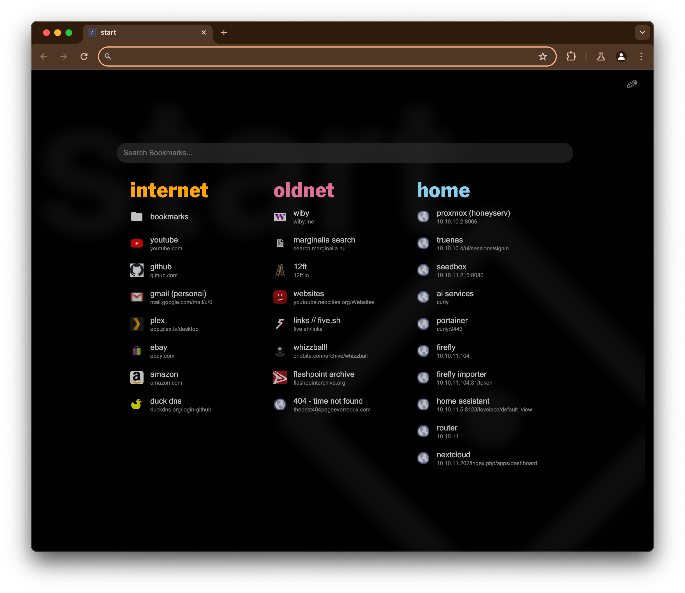

# startpage

[](https://github.com/heyjoeway/startpage/actions/workflows/main.yml)

This was previously a fork of [hello-friend](https://github.com/jaywick/hello-friend), but it outgrew its britches so I moved to Svelte. Thanks to the original project for the guidance of making a new tab extension and usage of the `chrome.bookmarks` API. Some features that came with the migration include fuzzy searching via Fuse.js and folder browsing.

## Preview



## WARNING

This sends domain URLs to Google to get high quality favicons and highlight colors. I'm planning to add configuration options to turn this off. Pull requests with solutions to this are welcome.

## Requirements

- Node/npm v18+

## Local development

```bash
git clone https://github.com/heyjoeway/startpage.git
cd startpage
npm install
npm run build
```

You can also use `npm run watch` to automatically rebuild the extension when you make changes.

### Loading into Chrome

0. Build the extension with `npm run build` as seen above
1. Go to `chrome://extensions/` in address bar
2. Tick _Developer mode_ toggle at top right
3. Click _Load Unpacked_
4. Choose the `dist` directory in the cloned repository.